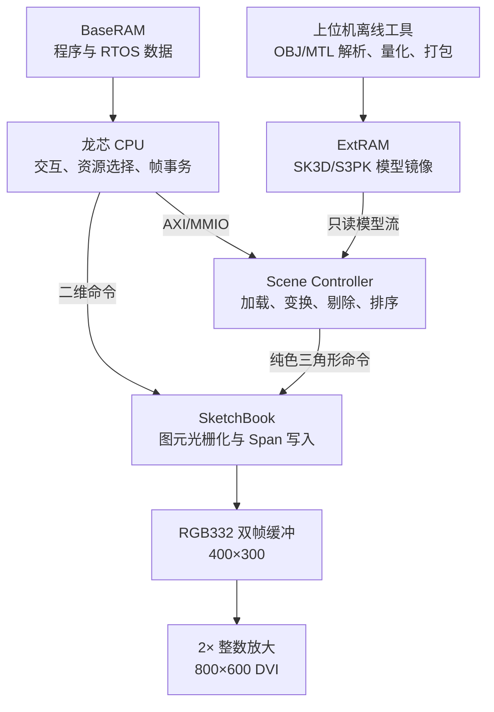
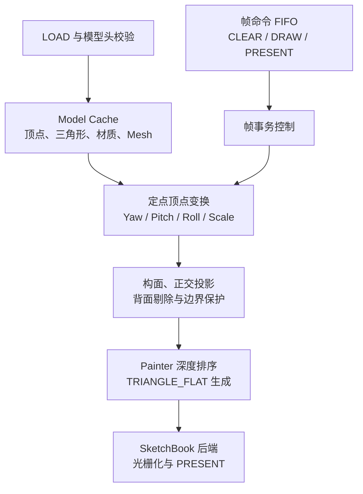
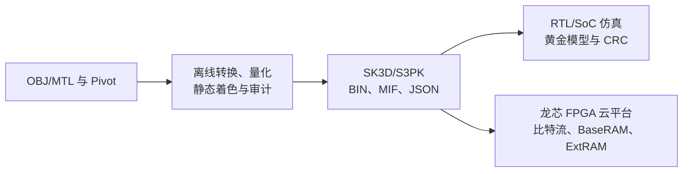

<!--
稿件状态：论文初稿（先导实验口径）
投稿前必须完成：作者信息、正式 5×300 帧实验、图5实拍图、图6-图7统计图、近3-5年3D图形硬件相关文献。
当前四帧短跑只能作为测量链路先导结果，不能据此声称正式 P99 或研究假设已成立。
-->

# 基于龙芯 FPGA 云平台的帧级三维场景卸载架构设计与评估

陈麒安，作者2，作者3，作者4

（浙江大学，杭州 310000）

摘要：针对资源受限 FPGA SoC 中三维几何处理占用 CPU 时间、通用图形处理器资源代价较高的问题，提出一种帧级场景卸载架构。Scene Controller 在 FPGA 内完成模型加载、定点顶点变换、构面、背面剔除与 Painter 排序，SketchBook 复用二维光栅化与显示后端，使 CPU 仅需提交模型地址、变换参数和帧事务。系统采用 RGB332 双缓冲、64 bit 八像素写入和局部视口刷新，并在龙芯 FPGA 云平台与 RT-Thread Nano 上完成实现。单 Mesh 先导实验表明，相较矩阵变换卸载，帧级卸载使 CPU 活跃周期中位数下降 97.27%～99.82%；实现占用 31.75% LUT、14.79% FF、23.29% BRAM 和 5.41% DSP，并满足时序约束。

关键词：帧级场景卸载；现场可编程门阵列片上系统；软硬件协同；三维图形；实时操作系统；国产平台

中图分类号：【待核定】　文献标识码：A　文章编号：【编辑部填写】

## Frame-Level 3D Scene Offloading Architecture Based on the Loongson FPGA Cloud Platform

CHEN Qi'an, Author 2, Author 3, Author 4

(Zhejiang University, Hangzhou 310000, China)

Abstract: To reduce processor occupation caused by three-dimensional geometry processing on resource-constrained systems-on-chip, a frame-level scene offloading architecture is proposed. A Scene Controller performs model loading, fixed-point vertex transformation, triangle assembly, back-face culling, and painter-based depth sorting. A shared SketchBook engine performs primitive rasterization, double buffering, and display output. Consequently, the processor only submits model addresses, transformation parameters, and frame transactions. The system employs RGB332 pixels, 64-bit eight-pixel packed writes, and local viewport refresh, and is implemented with RT-Thread Nano on the Loongson FPGA cloud platform. Functional regression covers five workload scales and three hardware-software partition schemes; all archived tests pass with identical framebuffer cyclic redundancy checks. Every performance workload uses one mesh and varies only the vertex and triangle counts. Pilot results show that frame-level offloading reduces median processor active cycles by 97.27%-99.82% compared with matrix-only offloading. The implementation utilizes 31.75% look-up tables, 14.79% flip-flops, 23.29% block random-access memory, and 5.41% digital signal processing blocks, while meeting the specified timing constraints. These results indicate that the architecture can reduce processor rendering overhead with limited hardware resources for controlled low-polygon scenes.

Keywords: frame-level scene offloading; FPGA SoC; hardware-software co-design; 3D graphics; real-time operating system; domestic platform

## 0 引言

机器人状态显示、嵌入式交互终端和教学实验平台中的低多边形三维可视化，需要在有限存储、逻辑资源和处理器算力下同时完成交互、几何处理与显示输出。若由中央处理器（Central Processing Unit，CPU）完成全部几何计算，逐顶点变换、逐三角形构面和排序会持续占用实时操作系统（Real-Time Operating System，RTOS）的可调度时间；若直接实现通用图形处理器，则纹理映射、逐像素深度缓存和复杂调度机制又会带来超出目标场景的资源开销。因此，资源受限现场可编程门阵列片上系统（Field-Programmable Gate Array System-on-Chip，FPGA SoC）需要一种边界清晰、规模可控的三维场景卸载方法。

已有 FPGA 图像处理和类专用集成电路加速研究表明，面向固定负载组织专用数据通路、片上缓存和并行计算单元，可提高端侧系统的吞吐率和资源效率[1-3]。异构 SoC 研究也说明，将控制密集型任务与规则计算任务分配给不同处理单元，是兼顾灵活性与计算效率的重要途径[4]。然而，上述工作主要面向神经网络计算或像素级图像处理；对于低模三维场景，CPU 与硬件之间应以矩阵运算、单个图元还是完整帧事务为划分边界，仍缺少同平台、等价负载下的量化比较。仅报告硬件吞吐率，也难以说明卸载所释放的 CPU 时间能否被 RTOS 用于输入、通信和控制任务。

针对上述问题，本文在龙芯 FPGA 云平台上构建 Scene Controller 与 SketchBook 两级图形架构。Scene Controller 将模型读取、顶点变换、构面、背面剔除和画家算法（Painter's Algorithm）排序封装为帧级事务；SketchBook 统一承担二维图元和纯色三角形的扫描线光栅化、双缓冲与数字视频接口（Digital Visual Interface，DVI）输出；RT-Thread Nano 负责交互、资源选择和命令提交；上位机工具完成 OBJ 模型解析、量化与静态面着色。

本文的主要工作如下：

1. 提出以模型缓存和 `CLEAR-DRAW-PRESENT` 命令序列定义的帧级卸载方法，将逐顶点、逐三角形处理从 CPU 迁移至可编程逻辑，并以三级对照实验评价软硬件划分边界。
2. 设计可同时服务二维界面与三维场景的轻量化显示后端，采用 RGB332、64 bit 八像素打包写入和显示边界换页控制，降低帧存储及像素写入开销。
3. 在国产 CPU 与 FPGA 协同环境中实现从模型资产、RTOS 软件、硬件比特流到远程运行的完整链路，并从 CPU 活跃周期、帧延迟、输出等价性和 FPGA 资源四个方面开展评估。

## 1 平台约束与总体架构

### 1.1 目标平台与设计边界

系统由龙芯 CPU、FPGA 可编程逻辑、BaseRAM、ExtRAM 及 DVI 显示接口组成。BaseRAM 保存启动程序、RT-Thread Nano 和运行数据，ExtRAM 保存 SK3D 或 S3PK 模型镜像，片上块随机存储器（Block Random-Access Memory，BRAM）用于模型缓存、命令队列和双页帧缓冲。主要配置见表1。

**表1 目标平台与冻结配置**  
**Table 1 Target platform and frozen configuration**

| 项目 | 配置 | 设计影响 |
|---|---:|---|
| CPU 时钟 | 33 MHz | CPU 周期按独立计时域统计 |
| 可编程逻辑时钟 | 50 MHz | 约束几何前端和图形后端关键路径 |
| 内部渲染分辨率 | 400×300 | 降低双帧缓冲容量 |
| DVI 输出分辨率 | 800×600 | 采用 2× 整数放大 |
| 像素格式 | RGB332 | 单像素 8 bit |
| 模型镜像空间 | 4 MB | 软件解析时进行边界检查 |
| 模型缓存上限 | 128 顶点、192 三角形、16 Mesh | 界定工作负载与结论范围 |
| 投影与着色 | 正交投影、纯色面着色 | 不含透视除法、纹理和动态光照 |

本文面向无纹理、低多边形、正交投影的状态可视化，不以替代通用图形处理器为目标。系统采用 4 bit 相位三角函数查找表、Q8.8 缩放和 RGB332 平面着色，使缓存容量、算术位宽和最坏执行时间能够静态约束。

### 1.2 系统架构与数据流

**图1 系统总体架构与软硬件数据流**  
**Fig. 1 Overall architecture and hardware-software data flow**

如图1所示，CPU 通过高级可扩展接口（Advanced eXtensible Interface，AXI）的存储器映射输入输出（Memory-Mapped Input/Output，MMIO）方式访问 Scene Controller 与 SketchBook。模型加载时，Scene Controller 的只读主接口从 ExtRAM 获取模型数据并写入片上缓存；渲染时，几何前端从缓存读取顶点和三角形，生成纯色三角形命令。SketchBook 对 CPU 的二维命令与 Scene Controller 的三维命令进行仲裁，并将像素写入后页帧缓冲；显示单元仅从前页读取像素。

该结构将低带宽控制流与高带宽像素流分离。CPU 只处理资源选择、姿态更新和帧事务，模型常量在连续动画帧中驻留片上缓存，像素写入不经过 CPU。二维用户界面与三维预览共享同一帧缓冲和换页协议，避免重复实现两套显示链路。

### 1.3 软硬件任务划分

**表2 系统任务划分**  
**Table 2 Hardware-software task partition**

| 执行端 | 主要任务 | 划分依据 |
|---|---|---|
| 上位机 | OBJ/MTL 解析、三角化检查、坐标归一化、静态面着色、资源打包 | 低频且算法复杂，可离线完成 |
| CPU | RTOS、输入与界面、资源选择、寄存器配置、帧命令提交 | 控制分支多，需要软件灵活性 |
| Scene Controller | 模型读取、定点变换、构面、剔除、排序、三角形命令生成 | 逐顶点和逐三角形重复计算 |
| SketchBook | 二维图元与三角形光栅化、帧缓冲写入、换页和显示 | 规则像素操作及高带宽写入 |

## 2 帧级三维场景控制器

### 2.1 模型加载与多端口缓存

Scene Controller 由寄存器层、模型抓取器、Model Cache、顶点变换单元、三角形前端、Painter 后端和帧命令先进先出队列（First In, First Out，FIFO）组成，如图2所示。`LOAD` 操作先读取 16 B 模型头，检查标识、版本、顶点数、三角形数和模型长度；任一字段超出配置上限时，控制器置位错误码并终止后续访问。校验通过后，顶点、三角形、材质和 Mesh 描述符分别写入对应缓存，`MODEL_VALID` 状态保持至下一次加载、软复位或错误。

**图2 Scene Controller 数据通路**  
**Fig. 2 Data path of the Scene Controller**

模型抓取接口最多保持一个未完成读事务，以适配基础 SoC 与 SRAM 的顺序访问时序。该方案不追求模型加载阶段的最大突发带宽，但加载仅在模型切换时发生；进入就绪状态后，连续动画帧均从 Model Cache 读取，因此 ExtRAM 访问量不随动画帧数线性增长。

构造一个三角形需要同时读取 3 个顶点。单端口存储器需分 3 拍读取，而异步多读口数组可能被综合为大量触发器和译码逻辑。为此，本文将 48 bit 顶点记录复制至 3 份一写一读 BRAM：加载时同步写入，构面时分别寻址，从而以存储容量换取稳定的 3 读端口。

### 2.2 定点变换与三角形前端

顶点变换单元将偏航、俯仰、滚转和缩放划分为 4 级寄存流水。三角函数由 16 相位查找表给出，余弦值通过相位偏移获得；各级数据同时携带有效标志与控制参数，使顶点可连续进入流水线。原始 16 bit 定点坐标经过旋转、Q8.8 缩放和平移后，以 24 bit 有效宽度写入工作存储。该实现不使用浮点运算和实时除法，可适配 50 MHz 系统时钟。

三角形前端根据索引读取 3 个变换后顶点，并采用正交投影得到屏幕坐标。屏幕平面的有向面积为

$$
A=(x_1-x_0)(y_2-y_0)-(x_2-x_0)(y_1-y_0).
$$

开启背面剔除时，仅保留 $A>0$ 的三角形。输出前将 $x$、$y$ 坐标限制在完整帧或局部视口边界内，防止异常坐标进入光栅器。该操作属于坐标钳位，而非严格的多边形裁剪，因此本文结论仅适用于经过离线检查的受控低模资产。

### 2.3 面级深度排序与后端复用

可见三角形以 3 个顶点的 $z$ 坐标之和作为深度键，Painter 后端按从远到近的顺序输出。对于不超过 192 个三角形的目标规模，面级排序只需保存三角形描述符和排序工作区，不需要建立与分辨率等大的逐像素深度缓存。以 400×300 分辨率和 16 bit 深度为例，单页深度缓存还需

$$
400\times300\times16=1.92\ \text{Mbit}
$$

存储，并引入逐像素比较与条件写入。

Painter 算法不能正确处理所有相交三角形和循环遮挡关系，本文不将其表述为通用深度缓存的替代方案。上位机黄金模型同时生成无深度缓存与带深度缓存的参考帧：前者用于验证硬件命令和量化规则，后者用于定位面级排序造成的遮挡误差。通过限制模型面数、合理划分 Mesh 和控制观察角，可在目标资源预算内获得稳定的状态可视化效果。

### 2.4 帧事务与多 Mesh 动画

帧命令模式将一帧描述为 `CLEAR`、若干 `DRAW` 和 `PRESENT`。每条 `DRAW` 包含 Mesh 标识、三轴平移、偏航、俯仰、滚转和 Q8.8 缩放参数。CPU 写入 4 个命令字并触发 `PUSH`；`FRAME_START` 生效后，FIFO 进入锁定状态，硬件按序消费命令，直至帧完成或发生错误才解除锁定。该协议禁止 CPU 在当前帧执行期间插入下一帧姿态，从事务边界上保证多部件动画的一致性。

**表3 帧命令语义**  
**Table 3 Semantics of frame commands**

| 命令 | 主要参数 | 硬件行为 |
|---|---|---|
| `CLEAR` | 清屏颜色、视口 | 清除完整后页或指定视口 |
| `DRAW` | Mesh ID、平移、旋转、缩放 | 执行变换、构面、剔除、排序并输出三角形 |
| `PRESENT` | 帧结束标志 | 请求在显示边界交换前后页 |

Mesh 描述符支持最多 16 个 Mesh，但冻结实现的帧命令 FIFO 深度为 16。完整容纳 `CLEAR + 16 DRAW + PRESENT` 需要至少 18 项，因此当前实现尚不能在一个批次中提交 16 Mesh 的完整帧事务。本文资源数据对应 FIFO 深度 16 的冻结实现；后续将深度扩展至 32 后，需要重新报告其查找表、触发器、BRAM 和最高工作频率代价。该限制应与“模型格式支持 16 Mesh”明确区分。

## 3 轻量化二维图形与显示后端

### 3.1 统一命令与扫描线写入

SketchBook 支持 `CLEAR`、`FILL_RECT`、`LINE`、`GLYPH`、`TRIANGLE_FLAT` 和 `PRESENT` 等命令。CPU 先写入 5 个 32 bit 暂存字，再触发 `CMD_PUSH`；命令 FIFO 无空位时，MMIO 接口通过反压延迟写完成，避免覆盖未执行命令。图形渲染单元按照命令类型进入相应状态，最终将不同图元统一转换为水平扫描线段（span）。

Span 适配器将横坐标、纵坐标、长度和颜色映射至 64 bit 存储字，并产生 8 bit 字节写使能。对齐区域每拍可写入 8 个 RGB332 像素，首尾非对齐区域仅开启对应字节通道，无需执行读-改-写。帧缓冲字地址为

$$
addr=page\_offset+y\times 50+(x\gg3),
$$

其中每行 400 像素恰好对应 50 个 64 bit 存储字，不需要行末填充。

### 3.2 RGB332 双帧缓冲

400×300 RGB332 单页帧缓冲的逻辑容量为 0.96 Mbit，双页为 1.92 Mbit；同分辨率 RGB565 双页需要 3.84 Mbit，因此逻辑容量降低 50%。低多边形场景以有限面色为主，3 bit 红色、3 bit 绿色和 2 bit 蓝色可与离线静态着色使用同一量化规则，同时使单次 64 bit 写入覆盖 8 个像素。

**图3 双帧缓冲换页协议**  
**Fig. 3 Double-buffer swapping protocol**

复位后控制器设置 `front=0`、`back=1` 且 `front_valid=0`，显示端保持黑场。渲染器固定写后页，`PRESENT` 只置位 `swap_pending`；控制器等待显示单元给出的帧边界后交换页号，产生 `swap_done` 并递增完成帧计数。换页挂起期间禁止继续写入后页，非法写入将锁存错误。由此，软件等待的完成事件对应实际显示边界，而不是命令刚进入队列的时刻。

### 3.3 显示输出与局部视口

显示单元采用 `src_x=h_cnt>>1`、`src_y=v_cnt>>1`，将 400×300 源帧整数放大为 800×600，无需增加乘法器或行缓存。针对 BRAM 同步读出的一拍延迟，水平同步、垂直同步、数据使能和像素通道同步延迟，以保持像素与显示时序对齐；消隐期将读地址归零，前页无效时输出黑色。

Scene Controller 支持局部视口和局部清屏。RT-Thread 主界面只更新右侧三维预览区，菜单与状态文字由 SketchBook 二维命令绘制并保留，从而减少重复命令。场景切换时，软件先中止当前 Scene 任务，待换页请求清除后再更新界面，避免二维绘制和三维渲染同时竞争图形后端。

## 4 软件系统与云平台实现

### 4.1 RT-Thread 软件组织

系统软件基于 RT-Thread Nano，划分为用户界面线程、输入线程和消息队列。按键中断服务程序仅累积按键位图并清除中断；输入线程周期性完成消抖和事件转换；用户界面线程消费事件并驱动主页、三维演示、Robot Walk 和系统状态页面。该组织避免在中断上下文中执行图形绘制、队列等待或长时间 MMIO 访问。

SketchBook 和 Scene Controller 驱动封装寄存器地址及命令格式。普通单模型模式写入模型地址、长度和变换参数后触发 `LOAD` 与 `RENDER`；多 Mesh 模式按帧写入 `CLEAR-DRAW-PRESENT` 队列，并依据完成帧计数判断换页结束。

### 4.2 模型格式与离线工具链

上位机工具将已三角化的 OBJ/MTL 模型转换为 SK3D 格式，并完成坐标系变换、居中、等比归一化、定点范围检查和静态面着色。V4 格式使用 Mesh 描述符记录各部件的顶点与三角形范围，并依据 pivot 文件将顶点转换到关节局部坐标。S3PK 将多个 SK3D 资源拼接为带目录的模型包，供软件按条目切换。

**图4 模型资产生成、验证与部署流程**  
**Fig. 4 Model asset generation, verification, and deployment flow**

运行软件首先检查 SK3D/S3PK 的标识、版本、目录大小、条目偏移和 4 MB 地址边界，再向 Scene Controller 提交实际模型基址与长度。JSON 审计文件记录模型规模、归一化比例、Mesh 范围和 pivot 信息；MIF 文件用于仿真初始化，BIN 文件用于远程平台 ExtRAM 镜像，使离线参考、RTL 仿真和平台运行采用同源资产。

### 4.3 龙芯 FPGA 云平台部署

工程以 `soc_top_sketch` 为顶层，结合板级约束生成 FPGA 比特流；RT-Thread 软件编译后形成 BaseRAM 镜像，S3PK 模型包形成 ExtRAM 镜像。远程部署时分别加载比特流、程序镜像和模型镜像，通过串行接口、按键交互与 DVI 输出检查 CPU 启动、存储访问、场景命令及显示链路。

龙芯 FPGA 云平台为本文提供国产 CPU 与可编程逻辑协同验证环境，并使各方案能够在相同时钟、存储映射与显示后端下比较。平台本身并非性能收益来源，因此后续实验固定编译选项、硬件频率、动画轨迹和模型资产，避免将平台差异误写为 Scene Controller 的加速效果。

<!--
图5建议插入：仿真或上板的“主页二维UI + 右侧三维Blade预览”画面，并与“Robot Walk多Mesh动画帧”并排组成(a)(b)子图。
优先从原始 sim/frame_output 或上板截屏导出，不要直接截取技术文档PDF；最终宽度建议 15-16 cm，单张源图至少 1800 px，分辨率不低于 300 dpi。
-->

**图5 二维界面与三维场景协同显示效果（待插入原始图）**  
**Fig. 5 Co-rendering results of the 2D interface and 3D scenes (source image pending)**

## 5 实验设计与结果分析

### 5.1 三级软硬件划分对照

为检验帧级卸载能否较矩阵运算卸载释放更多 CPU 可调度时间，设置表4所示的三级同平台对照。三种方案使用相同模型解析器、定点格式、三角函数查找表、投影、背面剔除、稳定排序、SketchBook 后端、RGB332 输出和动画轨迹，差异仅为几何处理的执行位置。

**表4 三级软硬件划分对照方案**  
**Table 4 Three hardware-software partition schemes**

| 方案 | CPU 工作 | 硬件工作 | 等待方式 |
|---|---|---|---|
| `CPU_ONLY` | 顶点变换、构面、剔除、排序、命令提交 | SketchBook 光栅化与显示 | 不调用几何加速器 |
| `CPU_MATMUL` | 矩阵 MMIO、结果整理、构面、剔除、排序、提交 | 矩阵变换、SketchBook 光栅化与显示 | 计入装载、启动、轮询和回读 |
| `SCENE_CONTROLLER` | 参数更新、帧命令提交、完成事件处理 | 完整几何处理、光栅化与显示 | 正式结果采用阻塞等待或完成事件 |

`CPU_MATMUL` 为主比较基准；`CPU_ONLY` 用于量化矩阵变换卸载的单独收益；`SCENE_CONTROLLER` 相对 `CPU_MATMUL` 的差值用于检验帧级卸载假设。

### 5.2 工作负载与输出等价性

正式实验按照顶点数 $V$ 和三角形数 $T$ 设置 S0～S4 五个规模点，见表5。所有性能工作负载均固定为单 Mesh，每个规模点使用确定性资产、固定哈希和 16 帧循环动画轨迹。Mesh 数不作为实验变量；Robot Walk 等多 Mesh 场景仅用于功能展示，不进入三级方案的性能统计或结论。

**表5 正式实验模型规模点**  
**Table 5 Model workload scales for the formal experiment**

| 规模 | 顶点数 $V$ | 三角形数 $T$ | 定位 |
|---|---:|---:|---|
| S0 | 16 | 24 | 轻载 |
| S1 | 32 | 48 | 规模扫描 |
| S2 | 64 | 96 | 中载候选 |
| S3 | 96 | 144 | 规模扫描 |
| S4 | 128 | 192 | 满载 |

正式实验须对同一资产、规模和轨迹帧逐帧比较三角形命令序列与后页帧缓冲循环冗余校验（Cyclic Redundancy Check，CRC）。命令字段或帧缓冲 CRC 任一不一致时，将该帧标记为不等价，其性能值不得进入主结果。

### 5.3 评价指标与成功判据

主指标为每帧 CPU 活跃周期数（active cycles），即 CPU 在统一插桩边界内执行该方案规定的软件工作所消耗的周期。帧级卸载相对矩阵卸载的主效应定义为

$$
R_{active}=1-\frac{\operatorname{median}(C_{scene})}{\operatorname{median}(C_{matmul})}.
$$

约束指标为从帧处理开始到 `PRESENT` 在显示边界完成的墙钟延迟。30 frame/s 的实时预算为 33.333 ms。正式实验每个条件预热 30 帧，随后采集 300 帧并独立重复 5 次；使用 1500 个有效帧按最近秩法计算第 99 百分位数（P99）。研究假设仅在输出等价、数据完整且同时满足以下条件时获得支持：

1. 相对 `CPU_MATMUL`，`SCENE_CONTROLLER` 的活跃周期中位数下降不少于 30%；
2. `SCENE_CONTROLLER` 的帧延迟 P99 增幅不超过 10%；
3. `SCENE_CONTROLLER` 的帧延迟 P99 不超过 33.333 ms。

支持指标包括 CPU 各软件阶段周期、RT-Thread 空闲率、固定低优先级后台任务吞吐、Scene/AXI 事务量，以及查找表（Look-Up Table，LUT）、触发器（Flip-Flop，FF）、BRAM、数字信号处理单元（Digital Signal Processing，DSP）和最高工作频率。CPU 的 `active/wall` 只表示已插桩渲染代码在帧窗口中的占比，不等同于全系统 CPU 利用率或 RTOS 空闲率。

### 5.4 功能回归与先导实验

功能回归覆盖 S0～S4 规模、`CPU_ONLY`、`CPU_MATMUL` 和 `SCENE_CONTROLLER` 三类路径，共归档 12 项测试；各测试均通过，方案间帧缓冲 CRC 一致。该结果证明三种路径在当前回归资产上的功能输出一致，但不能替代正式性能批次的逐帧等价性检查。

先导性能实验用于检查插桩、日志和统计链路，每个规模及方案仅采集 4 帧。帧级卸载在全部单 Mesh 规模点上的 CPU 活跃周期中位数均低于其余两种方案，相对矩阵卸载的降幅为 97.27%～99.82%。S4 结果见表6，其中 `active/wall` 的变化方向与活跃周期一致。

**表6 S4 单 Mesh 先导实验结果（每方案 n=4）**  
**Table 6 Pilot results for the S4 single-mesh workload (n=4 per scheme)**

| 指标 | `CPU_ONLY` | `CPU_MATMUL` | `SCENE_CONTROLLER` |
|---|---:|---:|---:|
| 活跃周期中位数 / cycle | 1,968,009 | 1,863,108 | 3,405 |
| `active/wall` 均值 / % | 82.64 | 82.25 | 0.32 |
| 4 帧短跑延迟上界 / ms | 75.823 | 73.680 | 34.723 |

由于每个条件只有 4 帧，先导数据不能形成有效 P99，也不能用于最终判定研究假设。当前短跑中，帧级卸载在 S0～S2 的观测延迟上界不超过 20.663 ms，S3 和 S4 分别为 34.741 ms 和 34.723 ms，后两者略高于 33.333 ms 帧预算。这表明 CPU 活跃周期大幅下降并不等价于端到端帧延迟必然满足实时约束，满载条件下的几何处理、排序或光栅化链路仍可能成为瓶颈。

<!--
图6待正式实验后生成：横轴 S0-S4，纵轴 CPU active cycles（对数坐标），三条折线分别为 CPU_ONLY、CPU_MATMUL、SCENE_CONTROLLER；每点显示中位数与95%置信区间。
图7待正式实验后生成：横轴 S0-S4，纵轴 P99 frame latency/ms；三条方案曲线，并增加 y=33.333 ms 的红色虚线。不要再使用“4帧循环扩展的P99代理”。
-->

**图6 不同规模下三级方案的 CPU 活跃周期（待正式实验生成）**  
**Fig. 6 CPU active cycles of the three schemes across workload scales (formal data pending)**

**图7 不同规模下三级方案的帧延迟 P99（待正式实验生成）**  
**Fig. 7 P99 frame latency of the three schemes across workload scales (formal data pending)**

### 5.5 FPGA 实现结果

冻结实现的资源、时序和功耗结果见表7。LUT、FF、BRAM 和 DSP 利用率分别为 31.75%、14.79%、23.29% 和 5.41%。建立/保持时间裕量均为正，总负裕量为 0，失败端点数为 0，表明设计满足当前用户时序约束。Vivado 给出的片上功耗为低置信度估算值，只能用于同工具、同设置下的相对比较，不能表述为板级实测功耗。

**表7 冻结实现的资源、时序与功耗结果**  
**Table 7 Resource, timing, and power results of the frozen implementation**

| 项目 | 使用量 / 可用量 | 利用率或结果 | 说明 |
|---|---:|---:|---|
| LUT | 42,735 / 134,600 | 31.75% | 图形控制、三角形计算、排序及 SoC 互连 |
| FF | 39,802 / 269,200 | 14.79% | 时序寄存资源余量较大 |
| BRAM | 85 / 365 | 23.29% | 帧缓冲、模型缓存和 FIFO |
| DSP | 40 / 740 | 5.41% | 定点架构未大量依赖 DSP |
| LUTRAM | - | 0.83% | 占用较低 |
| Setup/Hold Slack | - | +0.283 ns / +0.027 ns | 满足时序 |
| TNS/THS | - | 0 / 0 | 无负裕量 |
| Failing Endpoint | - | 0 | 无失败端点 |
| 片上功耗估算 | - | 0.537 W | 动态 0.393 W，静态 0.144 W；低置信度 |

资源结果表明，当前实现仍有扩展模型缓存、命令 FIFO 或局部深度缓存的空间，但不能仅凭总体利用率推断扩展后的最高频率。特别是将帧命令 FIFO 从 16 项扩展至 32 项后，需要在同一综合与实现设置下重新报告资源和时序变化。

## 6 结论

本文提出并实现了一种面向资源受限 FPGA SoC 的帧级三维场景卸载架构。该架构以模型缓存和 `CLEAR-DRAW-PRESENT` 帧事务为软硬件边界，将模型读取、定点顶点变换、构面、背面剔除和 Painter 排序从 CPU 迁移至 Scene Controller，并复用 SketchBook 完成二维图形、纯色三角形光栅化、RGB332 双缓冲及 DVI 显示。系统已在龙芯 FPGA 云平台和 RT-Thread Nano 环境中完成软硬件闭环验证。

功能回归表明，三级软硬件划分方案在当前归档测试中输出一致。单 Mesh 先导实验显示，帧级卸载相对矩阵卸载可将 CPU 活跃周期中位数降低 97.27%～99.82%；冻结实现占用 31.75% LUT、14.79% FF、23.29% BRAM 和 5.41% DSP，并满足既定时序约束。由于先导实验每个条件仅包含 4 帧，本文暂不据此报告正式 P99 或宣称研究假设成立。后续将完成固定单 Mesh、仅改变顶点数和三角形数的 5 次、每次 300 帧正式实验，并在扩展命令 FIFO 后重新评估资源和最高工作频率。本文结论限于正交投影、无纹理、RGB332、单 Mesh 性能负载且不超过 128 顶点和 192 三角形的受控低模场景。

## 参考文献

[1] 陈冠夫, 兰小磊, 陈镇城, 等. 基于国产 FPGA 与类 ASIC 架构的图像识别系统[J]. 集成电路与嵌入式系统, 2026, 26(2): 43-52.  
CHEN G F, LAN X L, CHEN Z C, et al. Image recognition system based on domestic FPGA and ASIC-like architecture[J]. Integrated Circuits and Embedded Systems, 2026, 26(2): 43-52.

[2] 谢天舒, 刘远光, 徐尚睿, 等. 面向人形机器人的 FPGA 综合图像处理系统[J]. 集成电路与嵌入式系统, 2026, 26(2): 71-80.  
XIE T S, LIU Y G, XU S R, et al. FPGA-based integrated image processing system for humanoid robots[J]. Integrated Circuits and Embedded Systems, 2026, 26(2): 71-80.

[3] 胡湘宏, 梁克龙, 尹飞跃, 等. 一种多精度可重构张量计算单元的设计[J]. 集成电路与嵌入式系统, 2026, 26(3): 81-89.  
HU X H, LIANG K L, YIN F Y, et al. Design of a multi-precision reconfigurable tensor computing unit[J]. Integrated Circuits and Embedded Systems, 2026, 26(3): 81-89.

[4] 潘斌. 一种可配置异构多核 SoC 的设计实现方法[J]. 【卷期页码待核对】.  
PAN B. Design and implementation method of a configurable heterogeneous multi-core SoC[J]. 【Publication details to be verified】.

[5] 【待补：近3～5年 FPGA/嵌入式三维几何流水线研究】

[6] 【待补：轻量化或开源嵌入式 GPU 架构研究】

[7] 【待补：软硬件任务划分或场景级卸载研究】

[8] 【待补：FPGA 光栅化、Painter 或局部深度缓存研究】

## 作者简介

陈麒安（本科生），主要研究方向为 FPGA SoC、数字集成电路设计与验证。【其余作者、指导教师、通信作者及电子邮箱待补】

---

## 投稿前编辑清单（提交时删除本节）

### 建议保留的图表

| 顺序 | 内容 | 形式 | 版面建议 | 当前状态 |
|---|---|---|---|---|
| 图1 | 系统总体架构 | 矢量框图 | 通栏；突出 CPU、Scene Controller、SketchBook 和存储流向 | 已有 Mermaid，定稿转 SVG/PDF |
| 表1 | 平台与设计边界 | 三线表 | 单栏或通栏 | 已完成 |
| 图2 | Scene Controller 数据通路 | 矢量框图 | 通栏；把核心创新模块放在视觉中心 | 已有 Mermaid，定稿转 SVG/PDF |
| 表3 | 帧命令语义 | 三线表 | 单栏 | 已完成 |
| 图3 | 双帧缓冲换页协议 | 时序/状态图 | 单栏；若有波形，优先改为“PRESENT-帧边界-swap_done”时序图 | 现为流程图 |
| 图4 | 资产生成与部署链路 | 矢量流程图 | 通栏 | 已有 Mermaid，定稿转 SVG/PDF |
| 图5 | 2D/3D 协同显示效果 | 两张实拍或仿真图 | (a)主页+Blade；(b)Robot Walk；两图等高 | 待从原始输出导出 |
| 表4 | 三级对照方案 | 三线表 | 通栏 | 已完成 |
| 表5 | 正式模型规模点 | 三线表 | 单栏 | 已完成 |
| 图6 | CPU 活跃周期随规模变化 | 折线图 | 对数纵轴，含 95% CI | 待正式数据 |
| 图7 | P99 帧延迟随规模变化 | 折线图 | 标出 33.333 ms 预算线 | 待正式数据 |
| 表7 | 资源、时序与功耗 | 三线表 | 通栏；不要再单独画资源柱状图，以免重复 | 已完成 |

### 图片排版规则

- 架构图和流程图优先使用 SVG 或 PDF 矢量格式；截图和照片至少 300 dpi。
- 同组界面图采用 `(a)`、`(b)` 子图编号，尺寸、裁切比例和字体保持一致。
- 图题放在图下，表题放在表上；中文题在前，英文题紧随其后。
- 正文必须先引用图表，再出现相应图表；避免图表跨越首次引用位置过远。
- 一张图只表达一个结论。资源利用率已由表7精确给出，不再用柱状图重复占版面。
- 所有坐标轴写明量和单位；误差线说明使用 95% 置信区间、标准差或其他定义。

### 仍需补齐的硬信息

- 作者顺序、指导教师、通信作者、电子邮箱、杯赛名称、报名编号 CICC1002311 和所获奖项。
- 固定单 Mesh、仅扫描顶点数和三角形数的 5×300 帧正式数据，以及逐帧等价性、RT-Thread 空闲率和后台任务吞吐。
- FIFO 深度 16 与 32 的同条件资源及时序对比。
- 3～5 篇近 3～5 年三维图形硬件相关核心文献，并核对全部卷、期、页码和英文著录。
- 图5的原始显示画面，以及图6、图7的正式统计图。
