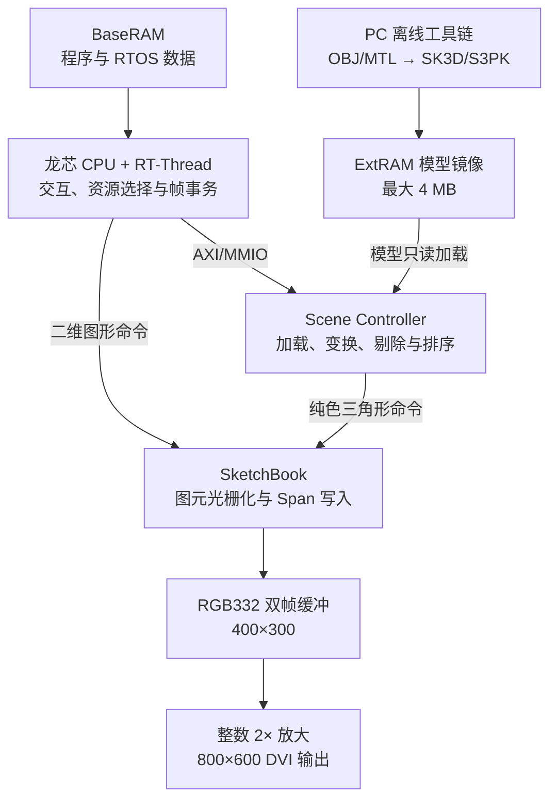
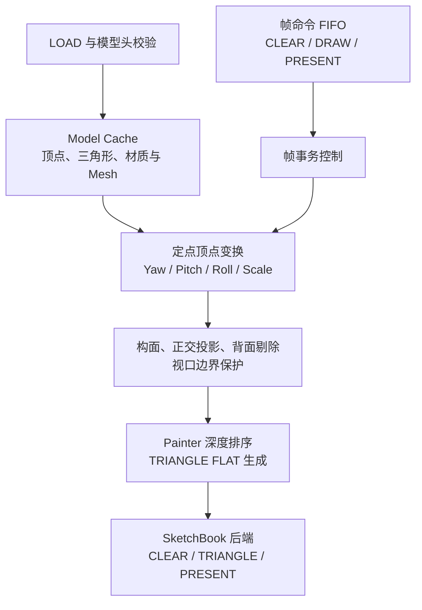
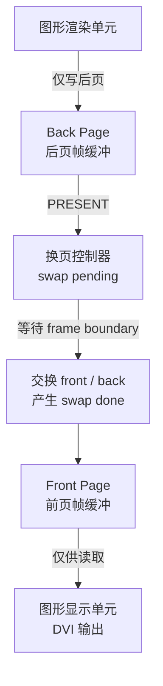
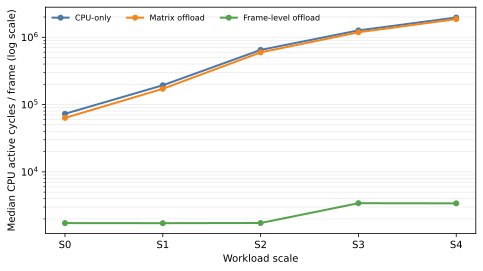
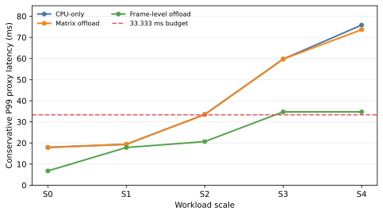
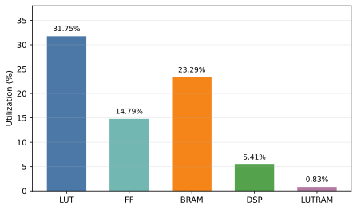

# 面向龙芯 FPGA 云平台的帧级 3D 场景卸载架构

> **稿件状态：**定稿（先导实验口径）。性能结果来自每个规模点/方案 4 帧短跑；文中“P99 代理”均指将短跑观测值按循环扩展得到的保守估计，不等同于 5×300 帧正式实验的实测 P99。

陈麒安<mark>，作者2，作者3，作者4</mark>

（浙江大学，杭州 310000）

摘要：针对资源受限 FPGA SoC 中 3D 几何处理占用 CPU 时间、通用图形处理器资源代价较高的问题，本文面向龙芯中科 FPGA 云平台提出一种帧级 3D 场景卸载架构。该架构以 Scene Controller 完成模型加载、定点顶点变换、构面、背面剔除和 Painter 深度排序，以 SketchBook 复用统一的二维图元光栅化与显示后端；通过 Model Cache 和帧命令 FIFO，使 CPU 仅需提交模型地址、变换参数及 CLEAR DRAW PRESENT 帧事务。系统采用 RGB332 双帧缓冲、64 bit 八像素打包和局部视口刷新，并在 RT Thread Nano 下实现模型切换与场景动画。S0--S4 的单 Mesh 先导仿真表明，相对仅卸载矩阵变换的方案，帧级卸载使 CPU active cycles 中位数下降 97.27%--99.82%；S0--S2 的短跑外推保守 P99 代理不超过 20.663 ms。综合结果显示，该实现占用 31.75% LUT、14.79% FF、23.29% BRAM 和 5.41% DSP，全部用户时序约束满足。

**关键词：**帧级场景卸载；FPGA SoC；RT Thread；软硬件协同；国产平台；轻量化图形

**中图分类号：**<mark>[待核定] 文献标识码：A 文章编号：[编辑部添加]</mark>

## 英文题名与摘要

### Frame-Level 3D Scene Offloading Architecture for the Loongson FPGA Cloud Platform

<mark>CHEN Qi'an, Author 2, Author 3, Author 4</mark>

(Zhejiang University, Hangzhou 310000, China)

Abstract: To reduce CPU occupation caused by 3D geometry processing on resource-constrained FPGA SoCs, this paper proposes a frame-level 3D scene offloading architecture for the Loongson FPGA cloud platform. A Scene Controller performs model loading, fixed-point vertex transformation, triangle assembly, back-face culling, and Painter depth sorting, while a shared SketchBook engine provides primitive rasterization and display output. With an on-chip model cache and a frame-command FIFO, the CPU submits only model addresses, transformation parameters, and CLEAR-DRAW-PRESENT transactions. The prototype integrates RGB332 double buffering, 64-bit eight-pixel packing, viewport refresh, RT-Thread Nano software, model switching, and scene animation. In single-mesh pilot simulations at S0--S4, frame-level offloading reduced median CPU active cycles by 97.27%--99.82% relative to matrix-only offloading; the conservative short-run P99 proxy was no more than 20.663 ms at S0--S2. The implementation uses 31.75% LUT, 14.79% FF, 23.29% BRAM, and 5.41% DSP, and meets all user timing constraints.

**Keywords:** frame-level scene offloading; FPGA SoC; RT-Thread; hardware-software co-design; lightweight graphics

<mark>赛事与作者信息：第十届全国大学生集成电路创新创业大赛参赛作品，杯赛名称、报名编号、奖项、指导教师及通信作者信息待补。</mark>

## 缩略语

| 缩写 | 英文全称 | 中文含义 |
|---|---|---|
| FPGA | Field-Programmable Gate Array | 现场可编程门阵列 |
| SoC | System on Chip | 片上系统 |
| CPU | Central Processing Unit | 中央处理器 |
| RTOS | Real-Time Operating System | 实时操作系统 |
| BRAM | Block Random-Access Memory | 块随机存储器 |
| FIFO | First In, First Out | 先进先出队列 |
| AXI | Advanced eXtensible Interface | 高级可扩展接口 |
| MMIO | Memory-Mapped Input/Output | 存储器映射输入输出 |
| DVI | Digital Visual Interface | 数字视频接口 |
| CRC | Cyclic Redundancy Check | 循环冗余校验 |
| LUT | Look-Up Table | 查找表 |
| FF | Flip-Flop | 触发器 |
| DSP | Digital Signal Processing Block | 数字信号处理单元 |
| WNS | Worst Negative Slack | 最差负裕量 |
| Fmax | Maximum Operating Frequency | 最高工作频率 |

## 0 引言

面向机器人状态显示、嵌入式交互终端和教学实验平台的低多边形三维可视化，需要在有限存储、逻辑资源和处理器算力下同时完成交互、几何处理与显示输出。若全部几何计算由中央处理器执行，逐顶点变换、逐三角形构面与排序会持续占用可调度时间；若直接移植通用图形处理器，又会引入纹理、深度缓存和复杂调度等超出目标场景的资源开销。因而，资源受限 FPGA SoC 需要一种任务边界清晰、实现规模可控的场景级卸载方法。

已有 FPGA 图像处理与类 ASIC 加速研究表明，面向固定负载组织专用数据通路、片上缓存和流水操作，可以改善端侧系统的吞吐与资源效率[1-3]。但这些工作主要关注神经网络或像素级图像处理，对低模三维场景中 CPU 与硬件之间应以矩阵运算、单个图元还是完整帧事务为边界，缺少同平台的量化比较。仅报告硬件模块的吞吐率，也难以说明卸载后释放的处理器时间能否被实时操作系统用于输入、通信和控制任务。

本文在赛方提供的龙芯 CPU、基础 SoC、两组 32 bit SRAM 接口和远程 FPGA 环境上，设计 Scene Controller 与 SketchBook 两级图形架构。Scene Controller 将模型读取、顶点变换、构面、背面剔除和 Painter 排序封装为帧级事务，SketchBook 统一承担二维图元和纯色三角形的 span 光栅化、双缓冲与 DVI 输出。RT Thread Nano 负责交互、资源选择与命令提交，PC 工具完成 OBJ 解析、量化和静态面着色。

本文的主要贡献包括：一是提出面向低模场景的帧级卸载边界，以 Model Cache 和 CLEAR DRAW PRESENT 命令队列减少 CPU 的逐顶点、逐三角形工作；二是复用轻量化二维图形后端，以 RGB332、64 bit 八像素写入和显示边界换页控制降低帧存储与写入开销；三是在龙芯中科 FPGA 云平台上形成从资产生成、软件镜像、硬件比特流到远程运行的完整实现，并设计 CPU 全几何、矩阵乘法卸载与整帧卸载三级对照，用 CPU 活跃周期、P99 帧延迟和 FPGA 资源共同评价软硬件划分。

## 1 平台约束与系统架构

### 1.1 目标平台与设计约束

目标系统采用龙芯 CPU 和 FPGA 可编程逻辑构成 SoC。BaseRAM 保存启动程序、RT Thread Nano 与运行数据，ExtRAM 保存 SK3D 或 S3PK 模型镜像，片上 BRAM 用于模型缓存、命令队列和双页帧缓冲。当前实验口径固定 CPU 频率为 33 MHz、RTL 时钟为 50 MHz，远程环境可用模型镜像空间为 4 MB。内部渲染分辨率为 400×300，显示端通过整数倍放大输出 800×600 DVI 信号。

本文面向无纹理、低多边形、正交投影的状态可视化，不以替代通用 GPU 为目标。模型总容量限制为 128 个顶点、192 个三角形和 16 个 Mesh；采用 4 bit 相位三角函数查找表、Q8.8 缩放和 RGB332 平面着色。上述限制使缓存、算术位宽和最坏时延可以在 FPGA 上静态确定，也界定了实验结论的适用范围。

### 1.2 总体架构与数据流

图1 系统总体架构与软硬件数据流

Fig. 1 Overall architecture and hardware-software data flow

系统总体架构如图1所示。CPU 通过高级可扩展接口的存储器映射输入输出方式访问 Scene Controller 与 SketchBook。模型加载时，Scene Controller 的只读主接口从 ExtRAM 获取模型数据并写入片上缓存；渲染时，几何前端从缓存读取顶点和三角形，输出纯色三角形命令。SketchBook 将 CPU 的二维命令与 Scene Controller 的三维命令仲裁后写入后页帧缓冲，图形显示单元仅从前页读出像素。

该结构把控制流与高带宽像素流分离。CPU 只处理资源选择、姿态更新和帧事务，模型常量在多帧动画中驻留片上缓存，像素写入不经过处理器。SketchBook 同时服务二维用户界面和三维场景，使文字、菜单、状态卡片与三维预览共享同一帧缓冲和换页协议，避免重复实现两套显示链路。

### 1.3 软硬件任务划分

表1 系统任务划分

Table 1 System task partition

| **执行端** | **主要任务**                                               | **划分依据**               |
|------------|------------------------------------------------------------|----------------------------|
| PC         | OBJ MTL 解析、三角化检查、坐标归一化、静态面着色、资源打包 | 低频且算法复杂，可离线完成 |
| CPU        | RTOS、输入与界面、资源选择、寄存器配置、帧命令提交         | 控制分支多，需软件灵活性   |
| Scene      | 模型读取、定点变换、构面、剔除、排序、三角形命令生成       | 逐顶点和逐三角形重复计算   |
| SketchBook | 二维图元与三角形光栅化、帧缓冲写入、换页和显示             | 规则像素操作与高带宽写入   |

## 2 帧级三维场景控制器

### 2.1 模型加载与片上缓存

Scene Controller 由寄存器层、模型抓取器、Model Cache、顶点变换单元、三角形前端、Painter 后端和帧命令 FIFO 组成，如图2所示。LOAD 操作先读取 16 B 模型头，检查 magic、版本、顶点数、三角形数与模型长度；任一字段超出配置上限时，控制器置错误码并停止后续访问。校验通过后，顶点、三角形、材质和 Mesh 描述符按记录类型写入对应缓存，MODEL VALID 状态保持至下一次加载、软复位或错误。

图2 Scene Controller 数据通路

Fig. 2 Data path of the Scene Controller

模型抓取接口保持至多一个未完成读事务，以适配基础 SoC 与 SRAM 的顺序访问时序。虽然该策略不追求模型加载阶段的最大突发带宽，但加载只在模型切换时发生；进入 READY 后，连续动画帧均从 Model Cache 读取，因此 ExtRAM 带宽与帧数解耦。

一个三角形需要同时读取三个顶点。若使用单端口存储器分三拍读取，会直接拉长构面阶段；若使用异步多读口数组，综合结果容易转化为大量触发器和译码逻辑。本文将 48 bit 顶点记录复制到三份 1W1R BRAM，加载时同步写入，构面时分别寻址三个副本，以 BRAM 容量换取稳定的三读端口和较短的组合路径。

### 2.2 定点变换与三角形前端

顶点变换单元把 Yaw、Pitch、Roll 和缩放分为四级寄存流水。三角函数由 16 相位查找表给出，余弦通过相位偏移获得；各级随数据携带 valid 与控制参数，允许顶点连续进入。原始 16 bit 定点坐标经旋转、Q8.8 缩放和平移后，以 24 bit 有效宽度写入工作存储。该实现避免浮点运算和实时除法，使关键路径适配 50 MHz 系统时钟。

三角形前端根据三个顶点索引读取变换结果，并采用正交投影得到屏幕坐标。屏幕平面的有向面积为 area=(x1-x0)(y2-y0)-(x2-x0)(y1-y0)，开启背面剔除时仅保留 area>0 的面。x 与 y 坐标在输出前限制到完整帧或局部视口边界，防止异常坐标进入光栅器。该边界保护属于坐标钳位，并非严格的多边形几何裁剪，因此论文结论限定于受控低模资产。

### 2.3 Painter 排序与后端复用

可见三角形以三个顶点 z 坐标之和作为深度键，Painter 后端按从远到近的顺序输出。对最多 192 个三角形的目标规模，面级排序只需要保存三角形描述符和排序工作区，不需要建立与分辨率等大的逐像素深度缓存。以 400×300 分辨率和 16 bit 深度为例，Z Buffer 还需约 1.92 Mbit 存储，并引入逐像素比较及条件写入。

Painter 算法不能保证相交三角形或循环遮挡关系完全正确，本文不将其表述为通用 Z Buffer 的替代方案。PC 侧黄金模型同时提供无 Z Buffer 与 Z Buffer 两类参考帧：前者用于检查硬件命令与量化规则的一致性，后者用于定位由面级排序带来的遮挡误差。通过限定低面数、合理 Mesh 分割和受控视角，可在资源预算内获得稳定的状态可视化效果。

### 2.4 帧命令事务与多 Mesh 动画

命令模式将一帧描述为 CLEAR、若干 DRAW 和 PRESENT。每条 DRAW 包含 Mesh 标识、三轴平移、Yaw Pitch Roll 和 Q8.8 缩放。CPU 写入四个命令字并触发 PUSH；FRAME START 生效后 FIFO 进入 locked 状态，硬件按序消费，直至 frame complete 或 frame error 才清空计数并解除锁定。该协议禁止处理器在当前帧执行期间插入下一帧姿态，从事务边界上保证多部件动画的一致性。

Mesh 描述符格式支持最多 16 个 Mesh。当前工程的 Scene 命令 FIFO 深度为 16；若需在单帧完整容纳 CLEAR + 16 DRAW + PRESENT，FIFO 应扩展至 32 项。本文综合结果对应当前冻结实现；由于尚未取得 FIFO 深度 16 与 32 的同条件综合报告，二者的资源及时序增量未作推断。Model Cache 保存不变的几何数据，每帧仅更新各 Mesh 的变换参数，因此机器人行走或机械臂姿态切换无需重复读取模型。

## 3 轻量化二维图形与显示后端

### 3.1 统一命令与 Span 写入

SketchBook 支持 CLEAR、FILL RECT、LINE、GLYPH、TRIANGLE FLAT 和 PRESENT 等命令。CPU 先写入五个 32 bit 暂存字，再触发 CMD PUSH；当命令 FIFO 无空位时，存储器映射接口通过反压延迟写完成，避免覆盖未执行命令。图形渲染单元按命令类型进入清屏、矩形、线段、字形或三角形状态，最终把不同图元统一转换为水平 span。

Span 适配器将 x、y、长度和颜色映射到 64 bit 存储字，并产生 8 bit 字节写使能。对齐区域每拍可写入 8 个 RGB332 像素，首尾不对齐区域仅打开对应 lane，无需读改写。帧缓冲地址为 word_addr=page_offset+y×50+(x>>3)，其中 400 像素恰好对应每行 50 个 64 bit 字，不存在行末填充。

### 3.2 RGB332 双帧缓冲

400×300 的 RGB332 单页帧缓冲逻辑容量为 960000 bit，双页为 1920000 bit；相同分辨率的 RGB565 双页需要 3840000 bit，逻辑容量降低 50%。低多边形场景主要使用有限面色，3 bit 红、3 bit 绿和 2 bit 蓝可与离线静态着色统一量化，同时让一个 64 bit 写入覆盖 8 个像素。

图3 双帧缓冲换页协议

Fig. 3 Double-buffer swapping protocol

帧控制器在复位后设置 front=0、back=1 且 front valid=0，显示端保持黑场。渲染器固定写后页，PRESENT 仅置位 swap pending；控制器等待图形显示单元给出的 frame boundary 后再交换页号，产生 swap done 并增加完成帧计数。换页挂起期间 render allowed 为 0，任何非法写入都会锁存错误。软件等待的是实际显示边界完成，而非命令刚进入队列的时刻。

### 3.3 显示输出与局部视口

图形显示单元以 src_x=h_cnt>>1、src_y=v_cnt>>1 将 400×300 源帧整数放大到 800×600，不需要额外乘法器或行缓存。由于 BRAM 同步读出存在一拍延迟，水平同步、垂直同步、数据使能和像素 lane 同步延迟，以保证像素与时序对齐。消隐期读地址归零，front valid 无效时输出黑色。

Scene Controller 可配置局部视口和局部清屏。RT Thread 主界面只更新右侧三维预览区域，菜单和状态文字由 SketchBook 二维命令绘制并保留，减少每帧重复命令。场景切换时，软件先中止当前 Scene，等待换页请求清除后再更新用户界面，避免 CPU 绘制与三维场景同时争用图形后端。

## 4 软件系统与云平台部署

### 4.1 RT Thread 软件组织

系统软件基于 RT Thread Nano，划分为 UI 线程、输入线程和消息队列。按键中断服务只累积按键位图并清除中断，输入线程周期性完成消抖和事件转换，UI 线程消费事件并驱动主页、三维演示、Robot Walk 与系统状态页面。该组织避免在中断上下文执行图形绘制、队列等待或长时间的存储器映射输入输出访问。

SketchBook 与 Scene Controller 驱动封装寄存器地址和命令格式，应用层通过 clear、draw triangle、present、scene load、scene render 和 scene command 等接口操作硬件。普通单模型模式写入模型地址、长度与变换参数后触发 LOAD 和 RENDER；多 Mesh 模式则按帧写入 CLEAR DRAW PRESENT 队列并等待完成帧计数变化。

### 4.2 模型格式与离线工具链

PC 工具链将已三角化的 OBJ 和 MTL 转换为 SK3D。转换过程完成坐标系变换、居中、等比归一化、定点范围检查和静态面着色；V4 格式通过 Mesh 描述符记录各部件的顶点与三角形范围，并依据 pivot 文件把顶点转换为关节局部坐标。S3PK 进一步把多个 SK3D 资源拼接为带目录的模型包，供软件按条目切换。

运行软件先检查 SK3D 或 S3PK 的 magic、版本、目录大小、条目偏移和 4 MB 边界，再向 Scene Controller 提交实际模型基址与长度。JSON 审计文件保存模型规模、归一化比例、Mesh 范围和 pivot 信息，MIF 用于仿真初始化，BIN 用于远程平台的 ExtRAM 镜像，从而使离线参考、RTL 仿真和上板资产保持同源。

### 4.3 龙芯中科云平台实现流程

龙芯中科 FPGA 云平台在本文中承担国产处理器与可编程逻辑协同验证环境。工程以 soc_top_sketch 为顶层，结合板级约束生成比特流；RT Thread 软件编译后形成 BaseRAM 镜像，S3PK 模型包形成 ExtRAM 镜像。远程部署时分别上传比特流、程序镜像和模型镜像，通过 UART、按键交互和 DVI 输出检查处理器启动、存储访问、场景命令及显示链路。

平台亮点的学术作用是验证所提软硬件边界能够落在国产 CPU SoC 环境中，并提供固定时钟、固定存储映射和统一远程运行条件。它不是替代架构创新的性能来源，因此实验比较必须在同一平台、同一编译选项、同一显示后端和同一工作负载下完成，避免把平台差异误写为 Scene Controller 的收益。

## 5 实验设计与结果分析

### 5.1 三级软硬件划分对照

为检验帧级场景卸载是否比单纯矩阵运算卸载释放更多 CPU 可调度时间，正式实验设置三种同平台方案。CPU ONLY 由处理器完成顶点变换、构面、剔除、Painter 排序和命令提交；CPU MATMUL 仅将顶点变换交给矩阵乘法器，处理器继续完成其余阶段；SCENE CONTROLLER 由硬件完成整帧几何处理，处理器仅更新场景参数、提交帧命令并处理完成事件。三种方案共用 SketchBook、显示分辨率、动画轨迹、定点规则和 RGB332 输出。

表2 三级对照方案

Table 2 Three hardware-software partition schemes

| **方案**   | **CPU 工作**        | **硬件工作**    |
|------------|---------------------|-----------------|
| CPU ONLY   | 全部几何与命令提交  | 光栅化和显示    |
| CPU MATMUL | 构面 剔除 排序 提交 | 顶点变换 光栅化 |
| SCENE      | 参数与帧事务        | 完整几何 光栅化 |

### 5.2 工作负载与等价性

模型族按顶点数 V 与三角形数 T 设置 S0 至 S4 五个单 Mesh 规模点。各规模点使用固定资产哈希和 16 帧循环轨迹；本稿报告每个条件 4 帧的先导短跑结果，冻结协议中的预热 30 帧、正式运行 300 帧并独立重复 5 次作为后续完整实验口径，不将其写作本次已完成的观测。

表3 模型规模点

Table 3 Model scale points

| **规模** | **V T**  | **用途** |
|----------|------------|----------|
| S0       | 16 24    | 轻载     |
| S1       | 32 48    | 规模扫描 |
| S2       | 64 96    | 中载候选 |
| S3       | 96 144   | 规模扫描 |
| S4       | 128 192  | 满载     |

功能回归记录显示三种模式在 S0--S4 的 12 项测试均通过且 CRC 一致。性能短跑批中，Scene Controller 与另两种方案除首帧外的 framebuffer CRC 不一致，因而本批数据只用于描述性性能比较，不能作为逐帧等价性的正式证据。

### 5.3 指标与成功判据

主指标为每帧 CPU active cycles，即处理器在统一插桩边界内执行该方案渲染软件工作所消耗的周期数。辅助指标为逐帧 `active/wall`，即该已插桩 CPU 有效工作在帧窗口中的占比。二者用于比较渲染路径的 CPU 开销，不等同于全系统 CPU 利用率或 RTOS 空闲率。约束指标为从帧处理开始到 PRESENT 完成的墙钟延迟及其 P99，30 frame/s 的实时预算为 33.333 ms。支持指标包括固定低优先级后台任务吞吐、Scene 与 AXI 事务量，以及 LUT、FF、BRAM、DSP 和最高工作频率。RT-Thread idle 字段随原始帧记录留存，但当前 Idle hook 的计账未经调度切换边界校准，故不参与方案比较或结论。

预先规定的成立条件为：相对 CPU MATMUL，SCENE CONTROLLER 的 active cycles 中位数下降不少于 30%，P99 帧延迟增幅不超过 10%，且 P99 不超过 33.333 ms。均值、中位数、标准差、P95、P99、最大值和 95% 置信区间均需报告，失败帧、超时帧和输出不等价帧单独计数，不得静默删除。

### 5.4 实验结果

**功能与等价性结果：**归档功能回归覆盖 S0--S4、CPU ONLY、CPU MATMUL 与 SCENE CONTROLLER 三种模式；各组合均完成 12 项测试并通过，归档结论为模式间 CRC 一致。短跑性能批共记录 60 帧，所有帧均为 `PASS`，且 `error=NONE`、`timeout=false`；然而 Scene Controller 在每个规模点仅与另两种方案的首帧 framebuffer CRC 相同，后续轨迹帧不一致，命令 CRC 字段为 0。因此，这 60 帧不计入等价帧数，也不用于正式协议的主判据。

**CPU 与实时性结果：**表4和图4--图5给出 4 帧先导样本的描述性结果。帧级卸载的 CPU active cycles 在全部规模点均低于另外两种方案，相对矩阵卸载的中位数降幅为 97.27%--99.82%。同一帧窗口内，S4 的平均 `active/wall` 从 CPU 全软件的 82.64% 和矩阵卸载的 82.25% 降至帧级卸载的 0.32%，与 active cycles 的降幅方向一致；该比例仅描述已插桩渲染工作，不可解释为全系统 CPU 利用率。S0--S2 的 P99 代理均不超过 33.333 ms；S3 和 S4 分别为 34.741 ms 和 34.723 ms，略超预算。帧级卸载批次记录到的后台任务吞吐为 12.0--51.2 units/s，而 CPU 全软件和矩阵卸载批次均为 0.0 units/s；该字段仅作辅助观测。原始 `idle_rate_permille` 在各方案中均接近 999--1000‰，且与 `active/wall` 不一致，当前不作为 RTOS 空闲率结果报告。P99 代理将观测到的 4 帧循环扩展至 1,500 帧后按最近秩法计算，等于观测最大值，并非正式实测 P99。

图4 不同规模下三级方案的 CPU active cycles 中位数（对数坐标）

Fig. 4 Median CPU active cycles of the three schemes across workload scales (log scale)

图5 不同规模下三级方案的保守 P99 代理帧延迟

Fig. 5 Conservative P99-proxy frame latency across workload scales

**资源与时序结果：**冻结实现使用 42,735/134,600 LUT（31.75%）、39,802/269,200 FF（14.79%）、85/365 BRAM（23.29%）和 40/740 DSP（5.41%）；LUTRAM 占用 0.83%。Setup/Hold Slack 分别为 +0.283 ns 和 +0.027 ns，TNS/THS 均为 0，Failing Endpoint 为 0，说明全部用户时序约束满足。片上功耗估算为 0.537 W，其中动态功耗为 0.393 W、静态功耗为 0.144 W。当前材料未提供 Fmax，以及 FIFO 从 16 扩展到 32 项的同条件资源/时序增量，故不作外推。

表5 冻结实现的资源、时序与功耗结果

Table 5 Resource, timing, and power results of the frozen implementation

|项目|结果|结论|
|---|---|---|
|LUT|42,735 / 134,600（31.75%）|仍有明显逻辑扩展空间|
|FF|39,802 / 269,200（14.79%）|时序寄存资源充足|
|BRAM|85 / 365（23.29%）|主要用于帧缓冲、模型缓存和 FIFO|
|DSP|40 / 740（5.41%）|定点架构未大量依赖 DSP|
|LUTRAM|0.83%|占用较低|
|Setup/Hold Slack|+0.283 ns / +0.027 ns|满足时序|
|TNS/THS、Failing Endpoint|0 / 0、0|全部用户时序约束满足|
|片上功耗|0.537 W（动态 0.393 W，静态 0.144 W）|估算值|

图6 冻结实现的主要 FPGA 资源利用率

Fig. 6 Major FPGA resource utilization of the frozen implementation

表4 先导实验结果汇总（每个单元 n=4）

Table 4 Summary of pilot experimental results (n=4 per cell)

| **指标**             | **CPU全软件**                  | **矩阵卸载**                   | **帧级卸载**                   |
|----------------------|--------------------------------|--------------------------------|--------------------------------|
| active cycles 中位数（S4） | 1,968,009 | 1,863,108 | 3,405 |
| active/wall 均值（S4）/% | 82.64 | 82.25 | 0.32 |
| P99 代理帧延迟（S4）/ms | 75.823 | 73.680 | 34.723 |
| 等价帧数（性能短跑批） | 0 | 0 | 0 |

## 6 结论

本文面向龙芯中科 FPGA 云平台，构建了由 Scene Controller、SketchBook、RT Thread Nano 和离线资产工具链组成的轻量化二维三维图形系统。所提架构以帧事务为软硬件边界，将模型加载、定点顶点变换、构面、背面剔除和 Painter 排序从 CPU 侧移入 FPGA，并通过 Model Cache、帧命令队列、RGB332 span 写入和显示边界换页控制形成完整实现。

在 S0--S4 单 Mesh 先导短跑中，帧级卸载相对矩阵卸载使 CPU active cycles 中位数降低 97.27%--99.82%；S4 的平均 `active/wall` 由 82.25% 降至 0.32%，说明在统一插桩边界内，CPU 承担的渲染路径工作显著减少。该指标不等同于全系统 CPU 利用率或 RTOS 空闲率。在实时性方面，S0--S2 的保守 P99 代理不超过 20.663 ms，S3 和 S4 分别为 34.741 ms 与 34.723 ms，略高于 30 frame/s 对应的 33.333 ms 预算；因此，本稿仅将低至中等规模下的实时性结果表述为短跑外推结论，不将其替代为正式 P99 结论。冻结实现的 LUT、FF、BRAM 和 DSP 利用率分别为 31.75%、14.79%、23.29% 和 5.41%，所有用户时序约束均满足，片上功耗估算为 0.537 W。上述结果表明，所提架构能够在正交投影、无纹理、RGB332、最多 128 顶点和 192 三角形的受控低模场景中显著降低 CPU 渲染开销，并在资源与时序预算内完成实现。性能短跑批的后续轨迹帧尚未取得三方案 framebuffer CRC 等价，5×300 帧的正式统计与逐帧等价验证仍是将该先导结论推广为正式性能结论所必需的验证工作。

## 参考文献

[1] 陈冠夫, 兰小磊, 陈镇城, 等. 基于国产 FPGA 与类 ASIC 架构的图像识别系统[J]. 集成电路与嵌入式系统, 2026, 26(2): 43-52.

[2] 谢天舒, 刘远光, 徐尚睿, 等. 面向人形机器人的 FPGA 综合图像处理系统[J]. 集成电路与嵌入式系统, 2026, 26(2): 71-80.

[3] 胡湘宏, 梁克龙, 尹飞跃, 等. 一种多精度可重构张量计算单元的设计[J]. 集成电路与嵌入式系统, 2026, 26(3): 81-89.

<mark>[待补：3D 几何流水、嵌入式 GPU 或场景级硬件卸载方向的近 3 至 5 年核心文献，并为中文文献补充英文著录。]</mark>

## 作者简介

陈麒安（本科生），主要研究方向为 FPGA SoC、数字集成电路设计与验证。<mark>[其余作者、指导教师、通信作者及常用电子邮箱待补。]</mark>
